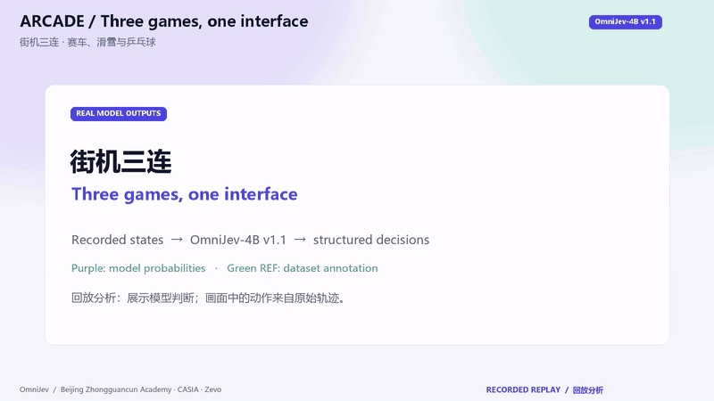
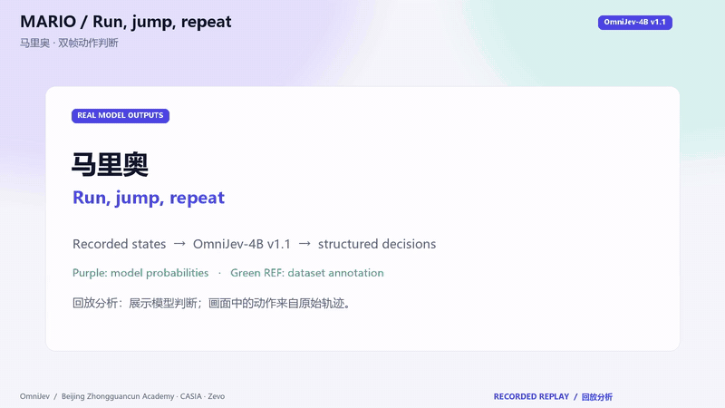
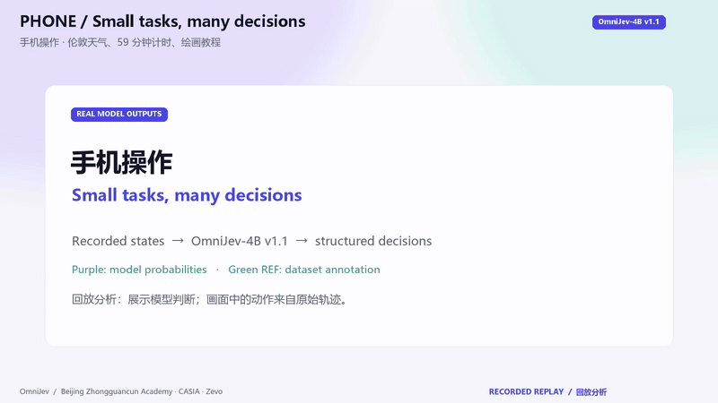
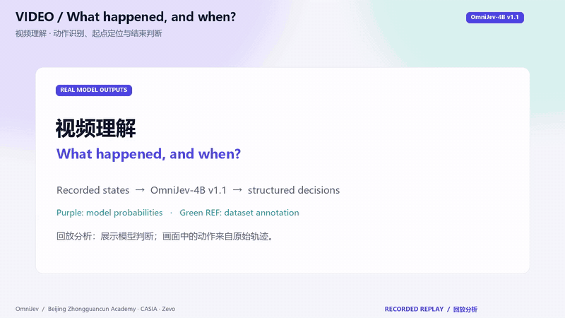

<div align="center">

# OmniJev

**An omni-modal Jev · 全模态 Jev**

*One forward pass, zero generated tokens: typed questions about images, videos, screens and robot scenes, answered with calibrated probabilities.*

[](https://omnijev.net/)
[](https://huggingface.co/tinnel123/OmniJev)
[](LICENSE)

**Beijing Zhongguancun Academy · Institute of Automation, Chinese Academy of Sciences · Zevo**

[Website](https://omnijev.net/) · [Try it online](https://omnijev.net/try.html) · [Weights](https://huggingface.co/tinnel123/OmniJev) · [中文文档](README_zh.md)

</div>

---

## What it can do

OmniJev fine-tunes Qwen3.5 vision-language backbones with LoRA, decision heads and an ordinal head. v1.1 covers web and phone operation, robot scenes, video, games, board games, audio spectrograms and text. The current training manifest is still being audited; the earlier 270,000-record figure is not an exact count for this release.

A 4B model that answers decision questions about images, video, phone and computer screens, games and robot scenes. The released demonstrations are offline replays; reliable closed-loop gameplay and robot control have not been established. It reads the picture together with your question and any text context, answers with **calibrated probabilities** instead of generated text, and can say *none of the above*.

## What it is

OmniJev is a *System One* decision model. You do not prompt it for text; you give it a state (images, video frames, screenshots, a camera feed, optional context) and a set of **typed questions**, and it returns a probability distribution for every question in **one forward pass with 0 generated tokens**:

| type | asks | returns |
|---|---|---|
| `choice` | which of these options (or none of them)? | a probability for every option, `abstain` = P(none of the above), the chosen key |
| `noul` | is this statement true of the state? | a calibrated probability |
| `score` | how far along an ordered scale? | a level and its probabilities |

Twelve questions about the same screenshot cost about as much as one. Options may also be **regions of the image** (`box: [x1, y1, x2, y2]`, coordinates in 0–1000), so "which element / which cell / where is the hazard" are ordinary choice questions. A video is sampled into 16 timestamped frames, which is exactly what the model sees.

## Released models

Three sizes, one code base (`mso.infer`), one API, all Apache-2.0, all on Qwen3.5 backbones:

| model | backbone | weights | download |
|---|---|---|---|
| **OmniJev-4B** | Qwen3.5-4B | [tinnel123/OmniJev](https://huggingface.co/tinnel123/OmniJev) · mirror [tinnel123/OmniJev-4B](https://huggingface.co/tinnel123/OmniJev-4B) | `hf download tinnel123/OmniJev --revision v1.1 --local-dir ckpt` · `hf download Qwen/Qwen3.5-4B --local-dir base` |
| **OmniJev-2B** | Qwen3.5-2B | [tinnel123/OmniJev-2B](https://huggingface.co/tinnel123/OmniJev-2B) | `hf download tinnel123/OmniJev-2B --revision v1.1 --local-dir ckpt` · `hf download Qwen/Qwen3.5-2B --local-dir base` |
| **OmniJev-0.8B** | Qwen3.5-0.8B | [tinnel123/OmniJev-0.8B](https://huggingface.co/tinnel123/OmniJev-0.8B) | `hf download tinnel123/OmniJev-0.8B --revision v1.1 --local-dir ckpt` · `hf download Qwen/Qwen3.5-0.8B --local-dir base` |

The separate generative SFT baseline is [tinnel123/OmniJev-SFT-0.8B](https://huggingface.co/tinnel123/OmniJev-SFT-0.8B). It uses PEFT text generation rather than `MSO1`.

Every example below works for all three: `MSO1("ckpt", "base")` picks the right path from the checkpoint. `pip install fla-core` is optional and turns on the fast linear-attention kernels.

Download all four weight packages and SHA-256 checksums from the [GitHub v1.1 release](https://github.com/tinnel123666888/OmniJev/releases/tag/v1.1).

## v1.1 replay demos

**8 short videos + a 40-second compilation, 209 states and 611 questions, all with real v1.1 4B inference.** Games, phones, web tasks, two-view robot scenes and video understanding. Purple shows model probabilities; green REF shows source annotations.

[All 8 demos](docs/demos_v11.md) · [Watch/download the compilation](https://github.com/tinnel123666888/OmniJev/raw/refs/heads/main/docs/media/v11/showreel.mp4) · [Download the full pack](https://github.com/tinnel123666888/OmniJev/releases/download/v1.1/OmniJev-v1.1-demo-pack.zip)

These are recorded-trajectory replays, not live model-controlled runs. Some inputs may overlap training; they are illustrations, not new benchmark results.

<table>
<tr>
<td width="50%"><a href="docs/media/v11/arcade.mp4"></a><br><sub><b>Arcade: Enduro, Skiing and Pong</b> · 22.5s · <a href="docs/media/v11/arcade.mp4">MP4</a></sub></td>
<td width="50%"><a href="docs/media/v11/mario.mp4"></a><br><sub><b>Mario: run and jump from two frames</b> · 16.5s · <a href="docs/media/v11/mario.mp4">MP4</a></sub></td>
</tr>
<tr>
<td width="50%"><a href="docs/media/v11/phone.mp4"></a><br><sub><b>Phone: weather, timer and drawing tutorial</b> · 26.2s · <a href="docs/media/v11/phone.mp4">MP4</a></sub></td>
<td width="50%"><a href="docs/media/v11/video.mp4"></a><br><sub><b>Video: action, start frame and completion</b> · 20.5s · <a href="docs/media/v11/video.mp4">MP4</a></sub></td>
</tr>
</table>

## What it does

The clips below illustrate tasks and the interface using historical releases. They are not newly generated v1.1 demonstrations or latency measurements.

<table>
<tr>
<td width="50%"><br><sub><b>A 21-step web task, page by page</b> — on every page the model picks the element, the operation, whether this is the last step and how far along the task is.</sub></td>
<td width="50%"><br><sub><b>Four robot tasks at once</b> — four LIBERO-10 episodes at video speed; every frame decides the sub-task, the gripper's next direction, grasp now, holding, first stage done.</sub></td>
</tr>
<tr>
<td><br><sub><b>Playing a game in real time</b> — paddle direction, next ball cell, bomb about to hit, score. One pass per frame, no search, no planner.</sub></td>
<td><br><sub><b>Operating a phone, step by step</b> — which action to perform, how irreversible it is, whether the screen shows an error dialog.</sub></td>
</tr>
<tr>
<td><br><sub><b>A long-horizon robot episode</b> — 276 frames of a two-stage manipulation task: instruction, sub-task, direction, grasp, holding, first stage done.</sub></td>
<td><br><sub><b>Watching a robot, judging every frame</b> — five decisions per frame; the amber tick on the rail is the real grasp.</sub></td>
</tr>
<tr>
<td><br><sub><b>Pointing on a grid, no boxes drawn by anyone</b> — a 96-cell grid over screenshots and photos; the model picks the cell, zooms in, picks again.</sub></td>
<td><br><sub><b>Navigating link by link toward a target page</b> — which link to follow at each hop, a probability on every candidate, stop when arrived.</sub></td>
</tr>
<tr>
<td><br><sub><b>Watching a camera feed for danger</b> — fire or smoke, what kind of hazard, how urgent, which region. The alarm bar is the model's own probability.</sub></td>
<td><br><sub><b>Gesture control</b> — a hand in front of a camera becomes a device command, fired only when the model is confident enough.</sub></td>
</tr>
<tr>
<td><br><sub><b>Judging what happened in a video</b> — did the event happen, in which frame it starts, is the person still in view, what is being done.</sub></td>
<td><br><sub><b>Ten held-out items, one stopwatch</b> — a photo, a phone screen, a chess board, a robot view, a whole video; the clock runs exactly as long as the model took.</sub></td>
</tr>
<tr>
<td colspan="2"><br><sub><b>Listening by looking</b> — five seconds of sound drawn as a spectrogram and a waveform: which sound it is, whether a person made it, whether it contains a sharp burst, how loud. <a href="docs/media/audio.mp4">The clip with the actual audio</a> is next to it in the repository.</sub></td>
</tr>
</table>

## Results — v1.1, 2026-09-26

**Score audit:** these are capped task-family aggregates, not complete per-dataset benchmark results. [Read the dataset/subset scores and missing coverage](docs/dataset_scores_v11.md). Mario next-action accuracy is 43.52% (193 questions), not the mixed 56.05%; OK-VQA 93.47% uses supplied candidates including the gold answer, not official open-ended VQA scoring. The old safety report covers HaGRID only.

[Full per-family metrics and counts](docs/results_v11_zh.md) · [Aggregate source reports](docs/results_v11.json) · [Release manifest](docs/release_v11.json)

### Overview: 30 common families

Macro accuracy gives each family equal weight; micro accuracy weights each report by its own question count. Mean family ECE is an average of per-family ECE values, not pooled ECE.

| Model | Families | Questions | Macro accuracy % | Micro accuracy % | Mean family ECE % ↓ |
| --- | ---: | ---: | ---: | ---: | ---: |
| Base 0.8B | 30 | 21,456 | 40.07 | 40.04 | 20.83 |
| SFT 0.8B | 30 | 41,951 | 47.86 | 48.09 | — |
| v1.1 0.8B | 30 | 41,975 | 64.52 | 65.40 | 4.30 |
| Base 2B | 30 | 21,456 | 36.30 | 35.94 | 34.21 |
| v1.1 2B | 30 | 41,975 | 64.46 | 65.42 | 6.27 |
| Base 4B | 30 | 21,456 | 40.12 | 39.79 | 30.04 |
| v1.1 4B | 30 | 41,975 | 70.00 | 70.82 | 5.89 |

### All families: accuracy (%)

| Family | Base 0.8B | SFT 0.8B | v1.1 0.8B | Base 2B | v1.1 2B | Base 4B | v1.1 4B |
| --- | ---: | ---: | ---: | ---: | ---: | ---: | ---: |
| androidcontrol | 29.49 | 40.73 | 71.70 | 21.54 | 71.84 | 28.81 | 77.30 |
| atari | 45.68 | 45.07 | 71.67 | 7.82 | 63.40 | 34.29 | 63.87 |
| audio | 20.71 | 44.53 | 51.07 | 35.39 | 42.01 | 34.16 | 53.08 |
| chess2 | 24.01 | 38.93 | 61.80 | 20.99 | 61.67 | 16.74 | 62.40 |
| chess3 | 5.62 | 13.00 | 20.00 | 6.17 | 15.13 | 5.49 | 22.67 |
| events | 39.09 | 48.53 | 85.87 | 48.56 | 86.47 | 55.56 | 89.13 |
| game | 41.15 | 47.33 | 83.51 | 17.15 | 80.32 | 15.36 | 90.36 |
| genmcq | 57.06 | 79.87 | 77.60 | 60.08 | 83.80 | 73.25 | 88.20 |
| gomoku | 52.54 | 45.67 | 69.80 | 18.24 | 68.27 | 16.60 | 70.60 |
| jat | 36.90 | 50.33 | 63.73 | 27.71 | 63.00 | 25.79 | 65.87 |
| jog_bridge | 28.12 | 28.80 | 43.84 | 24.14 | 48.43 | 29.36 | 45.97 |
| jog_full | 24.69 | 27.60 | 49.24 | 32.24 | 49.04 | 28.26 | 51.56 |
| longtext | 21.26 | 62.53 | 76.42 | 36.21 | 77.68 | 59.40 | 80.28 |
| lvb | 41.80 | 52.60 | 47.20 | 57.38 | 50.00 | 59.02 | 56.80 |
| mario | 27.43 | 40.14 | 53.88 | 52.13 | 54.69 | 46.78 | 56.05 |
| music | 34.98 | — | — | 32.92 | — | 34.71 | — |
| mutex | 47.33 | 50.73 | 73.33 | 25.10 | 70.73 | 25.24 | 79.07 |
| old | 53.91 | 61.60 | 67.54 | 58.44 | 66.06 | 58.02 | 70.76 |
| pilot_web | 39.51 | 37.20 | 67.13 | 37.04 | 66.47 | 42.80 | 75.80 |
| point_phone | 40.27 | 37.68 | 60.91 | 39.09 | 60.69 | 46.61 | 72.53 |
| pope | 85.46 | 84.20 | 66.73 | 82.44 | 66.87 | 86.42 | 84.73 |
| roboarena_wrist | 38.55 | 55.87 | 65.93 | 32.92 | 66.27 | 33.20 | 67.80 |
| robot_long | 54.87 | 49.80 | 79.79 | 29.77 | 78.46 | 29.36 | 85.04 |
| safety | 52.81 | 68.93 | 97.73 | 58.44 | 99.07 | 67.90 | 99.53 |
| snake | 44.03 | 47.00 | 83.60 | 34.57 | 82.87 | 44.86 | 84.47 |
| video | 39.09 | 43.47 | 57.51 | 38.41 | 59.10 | 49.11 | 62.81 |
| vqa | 79.15 | 76.47 | 63.87 | 83.26 | 79.60 | 85.73 | 93.47 |
| web | 41.02 | 48.27 | 66.87 | 31.55 | 67.53 | 31.28 | 76.80 |
| webtest | 40.47 | 48.40 | 67.13 | 26.20 | 67.87 | 30.45 | 77.40 |
| wiki | 41.84 | 47.80 | 68.00 | 39.78 | 68.53 | 33.74 | 72.13 |
| xiangqi | 8.09 | 12.87 | 22.27 | 6.31 | 18.07 | 10.15 | 23.67 |

### Evaluation protocol and limitations

The table reports existing evaluations, **not a matched-sample ablation**. Base models use candidate-answer probabilities (`A1_raw`), with at most 1,000 questions per family before dev/test splitting. OmniJev and SFT typically use about 1,500 questions per family. Sampling, option truncation and image inputs differ. The 30-family summary excludes music, for which only base results exist.

The released SFT baseline is 0.8B only. Its 41,951 generations were judged and audited: 97 incorrect explicit answer labels were accepted by the raw LLM judge. Audited accuracy is **48.0894%** (equal to the parser), rather than the uncorrected judge's 48.3207%.

v1.1 OmniJev uses numbered multi-image panels. The historical SFT and base evaluations used the first still image only. Multi-image SFT retraining and inference over the newly frozen 272,561-question set are **not completed**. The 20-step distributed smoke checkpoint is not part of this release.

These are project evaluation families, not uniform official benchmark scores. POPE and LongVideoBench were excluded from training; Mind2Web uses official splits. Other families include custom row-level holdouts; the event-timing family uses videos from the Charades-STA training set. Row-level exclusion does not establish episode-level separation.

The main table contains raw evaluation reports, **not a new evaluation of the calibrated serving outputs**. Released temperature metadata comes from a separate calibration split. The 4B checkpoint also contains `biases.noul=0.0531085661`, which moves the yes/no boundary; therefore its raw POPE result must not be restated as a serving-path result.

4B has the highest 30-family macro accuracy, but POPE (84.73% vs 86.42% base) and LVB (56.80% vs 59.02% base) remain lower. The 0.8B and 2B models also have substantial POPE regressions. All rows are retained.

### Calibration

ECE measures the average confidence–accuracy gap across bins; lower is better. It does not guarantee that every individual confidence level is within that gap. Brier score and NLL are also reported in the full results. Generative SFT reports did not retain calibrated answer probabilities, so its ECE is unavailable.

The independent calibration set has 7,767 dev and 17,754 test questions. Temperature scaling preserves argmax accuracy; the additional 4B yes/no bias can change it. Calibration metadata reports temperature-only results.

| Size | Type | n | Temperature | Accuracy % | Raw ECE % | Calibrated ECE % | Raw Brier | Calibrated Brier | Raw NLL | Calibrated NLL |
| --- | ---: | ---: | ---: | ---: | ---: | ---: | ---: | ---: | ---: | ---: |
| 0.8B | noul | 5566 | 0.9574 | 86.58 | 1.94 | 1.33 | 0.1862 | 0.1864 | 0.2962 | 0.2961 |
| 0.8B | choice | 9226 | 0.9983 | 52.92 | 1.34 | 1.39 | 0.5512 | 0.5512 | 1.3374 | 1.3374 |
| 0.8B | score | 2962 | 1.0642 | 66.41 | 3.15 | 2.90 | 0.4266 | 0.4270 | 0.7694 | 0.7712 |
| 2B | noul | 5566 | 1.0181 | 86.74 | 0.93 | 0.89 | 0.1881 | 0.1881 | 0.3012 | 0.3010 |
| 2B | choice | 9226 | 1.1253 | 51.08 | 1.60 | 2.31 | 0.5612 | 0.5613 | 1.4139 | 1.4123 |
| 2B | score | 2962 | 1.0173 | 64.28 | 3.11 | 3.21 | 0.4507 | 0.4510 | 0.8170 | 0.8178 |
| 4B | noul | 5566 | 1.1991 | 89.17 | 2.35 | 1.00 | 0.1545 | 0.1530 | 0.2524 | 0.2484 |
| 4B | choice | 9226 | 1.1199 | 56.33 | 2.20 | 1.44 | 0.5155 | 0.5153 | 1.2547 | 1.2517 |
| 4B | score | 2962 | 1.1909 | 66.91 | 5.24 | 3.42 | 0.4260 | 0.4221 | 0.7504 | 0.7445 |

### Latency

The previous release measured 1/3/6/12-question requests on one idle A800-SXM4-40GB: 4B 294/292/344/436 ms; 2B 217/220/243/277 ms; 0.8B 216/216/218/236 ms. These are historical measurements, not new v1.1 serving benchmarks. The v1.1 source reports contain per-family latency, but do not form a controlled hardware-matched speed comparison. All Qwen3.5 sizes use the prefix-branch path.

## Quick start

```bash
git clone https://github.com/tinnel123666888/OmniJev && cd OmniJev
python -m venv venv && ./venv/bin/pip install -r requirements.txt     # torch, transformers>=5, pillow

hf download tinnel123/OmniJev --revision v1.1 --local-dir ckpt                       # the OmniJev weights
hf download Qwen/Qwen3.5-4B --local-dir base               # the backbone (or symlink a local copy)
```

**An image.** Questions are a map `id -> question`; the answers come back under the same ids.

```python
from mso.infer import MSO1

m = MSO1("ckpt", "base")
answers = m.system_one(
    {"images": ["screen.png"]},
    {"op":   {"type": "choice", "instructions": "Which operation comes next?",
              "criteria": {"click": "tap an element", "type text": "", "scroll": ""}},
     "risk": {"type": "score",  "instructions": "How irreversible is the next action?",
              "levels": ["harmless", "needs care", "irreversible"]},
     "err":  {"type": "noul",   "instructions": "This screen shows an error dialog."}})
# answers["op"]   -> {"choice": "click", "probabilities": {"click": 0.81, ...}, "abstain": 0.02, "confidence": 0.81}
# answers["risk"] -> {"score": "needs care", "probabilities": {...}, "confidence": 0.7}
# answers["err"]  -> {"noul": 0.01}
```

**A video.** `video_state` samples 16 timestamped frames into one picture (ffmpeg and ffprobe must be on PATH); the model then judges the whole clip.

```python
from mso.video import video_state

answers = m.system_one(
    video_state("clip.mp4"),                                  # writes clip.mosaic.jpg next to the clip
    {"happened": {"type": "noul",   "instructions": "The person opens the door."},
     "doing":    {"type": "choice", "instructions": "What is the person doing?",
                  "criteria": {"cooking": "", "cleaning": "", "reading": "", "eating": ""}},
     "progress": {"type": "score",  "instructions": "How much of the action is shown?",
                  "levels": ["none of it", "the beginning", "most of it", "all of it"]}})
```

**Text context.** Put it in front of the instructions; the model reads it together with the picture (the served API does the same with `state.text`).

```python
task = "Task: book a table for two at 7 pm on the restaurant's website."
answers = m.system_one(
    {"images": ["page.png"]},
    {"op":   {"type": "choice", "instructions": task + "\nWhich operation comes next?",
              "criteria": {"click": "tap an element", "type text": "", "select": "", "scroll down": ""}},
     "done": {"type": "noul",   "instructions": task + "\nThe task is finished."}})
```

**Regions.** A choice option can be a region instead of a name: `"options": [{"key": "a", "region": {"box": [120, 40, 380, 90]}}, ...]` (0–1000). `mso/templates.py` has ready-made question sets for browsers, phones, robots, games and grids (`templates.questions("libero", instruction=...)`), and `mso/infer.py` is also a CLI (`--ckpt --model --image --questions`).

## How it was trained

v1.1 uses Qwen3.5 0.8B, 2B and 4B backbones with rank-32 LoRA, decision and ordinal heads, LM features, prefix-branch inference and multi-image panels. This continuation trained for 5,000 / 4,000 / 3,000 steps respectively. Earlier curricula differ across sizes, so these are not equal cumulative training budgets. Training uses probabilistic scoring rules, followed by temperature calibration on a separate holdout.

The 0.8B generative SFT baseline trained for 12,500 steps, learning rate 1e-4 and accumulation 4. It generates answer text, has no OmniJev decision heads and does not use `MSO1`. Its historical training path reads the first still image only. Training record manifests and cumulative budgets are not aligned enough to call this a strict same-data comparison.

## License and citation

**Apache-2.0** (see [LICENSE](LICENSE)) for the code and the weights; the backbone keeps its own license.

```bibtex
@misc{omnijev2026,
  title  = {OmniJev: an omni-modal System One decision model},
  author = {Xu, Tianrun and Fan, Hongbang and Lin, Jiahao and Zhu, Zilin and Diao, Zhenxin and Guo, Longteng and Liu, Jing},
  note   = {Beijing Zhongguancun Academy; Institute of Automation, Chinese Academy of Sciences; Zevo},
  year   = {2026},
  url    = {https://github.com/tinnel123666888/OmniJev}
}
```


## Team and contact

OmniJev is developed jointly by **Beijing Zhongguancun Academy**, the **Institute of Automation, Chinese Academy of Sciences** and **Zevo**.

Main contributors

- Tianrun Xu (徐添润) · Core Developer
- Hongbang Fan (范红榜)
- Jiahao Lin (林佳豪)
- Zilin Zhu (朱子林)
- Zhenxin Diao (刁镇薪)
- Longteng Guo (郭龙腾) · Project Lead
- Jing Liu (刘静) · Corresponding Author

Contact — academic exchange and collaboration: s-xtr24@bza.edu.cn

<div align="center"><sub>北京中关村学院 · 中国科学院自动化研究所 · 智进化 · <a href="https://omnijev.net/">omnijev.net</a></sub></div>
