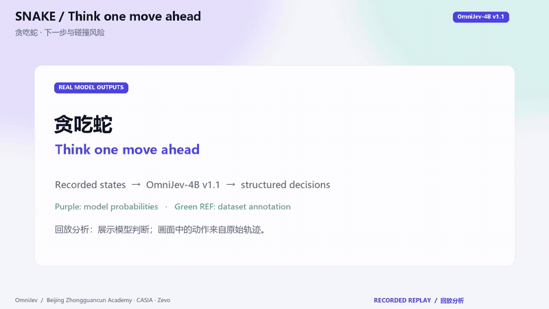
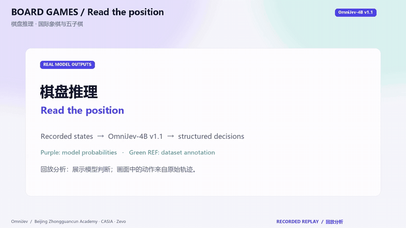
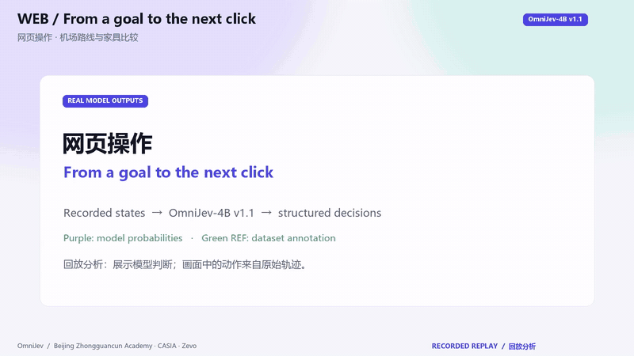
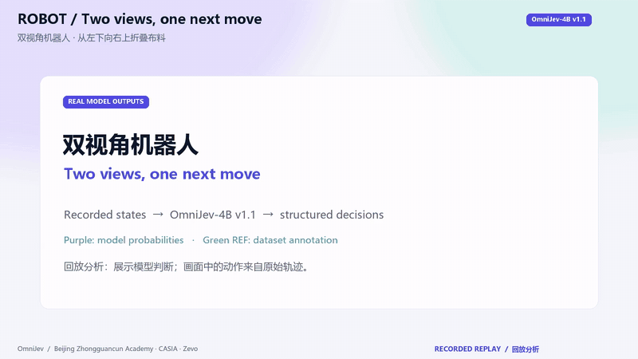

# OmniJev v1.1 — new replay demos / 新版演示

Eight short videos and a 40-second compilation, produced with **OmniJev-4B v1.1**: **209 recorded states, 611 typed questions**. The light cards, indigo/teal probability bars and bilingual captions follow the project's existing demos.

8 支短片与约 40 秒合集，使用 v1.1 4B 的真实推理结果，覆盖 209 个状态、611 个问题；沿用浅色卡片、靛蓝/青绿概率条与双语标题。

[Watch/download the compilation / 合集](https://github.com/tinnel123666888/OmniJev/raw/refs/heads/main/docs/media/v11/showreel.mp4) · [Download the full demo pack / 完整下载包](https://github.com/tinnel123666888/OmniJev/releases/download/v1.1/OmniJev-v1.1-demo-pack.zip) · [Manifest and SHA-256 hashes](demos_v11_manifest.json)

<table>
<tr>
<td width="50%"> <b>贪吃蛇 · 下一步与碰撞风险</b> · 19.0s · <a href="media/v11/snake.mp4">MP4</a></td>
<td width="50%"> <b>马里奥 · 双帧动作判断</b> · 16.5s · <a href="media/v11/mario.mp4">MP4</a></td>
</tr>
<tr>
<td width="50%"> <b>街机三连 · 赛车、滑雪与乒乓球</b> · 22.5s · <a href="media/v11/arcade.mp4">MP4</a></td>
<td width="50%"> <b>棋盘推理 · 国际象棋与五子棋</b> · 14.4s · <a href="media/v11/board.mp4">MP4</a></td>
</tr>
<tr>
<td width="50%"> <b>手机操作 · 伦敦天气、59 分钟计时、绘画教程</b> · 26.2s · <a href="media/v11/phone.mp4">MP4</a></td>
<td width="50%"> <b>网页操作 · 机场路线与家具比较</b> · 25.5s · <a href="media/v11/web.mp4">MP4</a></td>
</tr>
<tr>
<td width="50%"> <b>双视角机器人 · 从左下向右上折叠布料</b> · 12.5s · <a href="media/v11/robot.mp4">MP4</a></td>
<td width="50%"> <b>视频理解 · 动作识别、起点定位与结束判断</b> · 20.5s · <a href="media/v11/video.mp4">MP4</a></td>
</tr>
</table>

**Mario limitation / 马里奥局限：** This replay does not demonstrate gameplay competence. Its next-action match rate is 24/28, exactly the same as always choosing `right_B` on this clip; the historical held-out next-action score is 43.52% (193 questions). No closed-loop success rate has been established. [Dataset score audit / 成绩审计](dataset_scores_v11.md).

## Reading the videos / 如何看

- Purple bars show the model's probabilities; green **REF** text is the dataset annotation. Incorrect predictions are retained.
- These are **recorded-trajectory replays**, not live model-controlled games, browser sessions or robot runs. Playback speed is edited for readability and is separate from the measured inference time.
- Each video-understanding request sees all eight sampled frames. Its probabilities stay fixed as those frames play; the cursor is not an online inference indicator.
- The scenes were selected by task and sequence before inference, not by prediction correctness. Some records may overlap training. These videos are illustrations, not benchmark scores or evidence of episode-level generalization.

紫色表示模型概率，绿色 REF 表示数据集参考标注；保留判断不一致的画面。所有操作来自原始轨迹，视频回放速度与实际推理耗时分别处理。视频理解使用完整 8 帧输入。片段在推理前按任务与时间选取，部分可能与训练数据重叠，因此不能据此宣称实时控制成功率或泛化成绩。

## Inputs and production / 输入与制作

| Video | Input source | Displayed tasks |
| --- | --- | --- |
| Snake | Synthetic Snake trajectories | Next direction, collision risk, food direction |
| Mario | OpenGenGAME Super Mario Bros | Next input, jump, run |
| Arcade | JAT Atari recordings | Enduro, Skiing, Pong: next input, steering, reward |
| Board games | Chess positions; synthetic Gomoku | Move selection, check/material, five-in-a-row threats |
| Phone | AndroidControl | London weather map; 59-minute timer; drawing tutorial |
| Web | Mind2Web official test-task split | Central Park–JFK route; compare solid-wood nightstands |
| Robot | Bridge recordings | Fold a cloth, two views: jog direction, gripper, move size |
| Video | Charades event frames | Action recognition, first matching frame, completion |

Inference used eight independent MLU590 workers with the released 4B v1.1 adapter and heads, bfloat16, and the shipped calibration. Warm-up was excluded. The displayed time is synchronized wall time for the whole request, including input processing, not an isolated model-forward or controlled serving benchmark. Checkpoint hashes and output-video hashes are recorded in the manifest.

MP4: 1600×900, H.264, 24 fps, no audio. GIF: 800×450, 8 fps. All nine MP4 files were fully decoded, all eight GIFs checked, and all 611 probability outputs checked for finite values in [0, 1]. Open `index.html` in the download pack for the portable video gallery.

Third-party recordings and screenshots remain subject to their upstream terms; the project's code license does not relicense those media.
